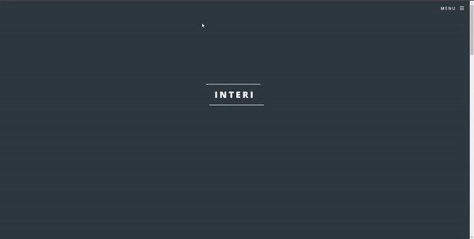

## MVC Lecture: <a href="" target="_blank">Check it out here</a>

### Learn about Model-View-Controller (MVC) software architectural pattern!

## Tech Used to create lecture: 

My learning was focused on creating an interactive, fun lecture to help other developers understand the concept of MVC. MVC is often used for developing user interfaces that divide the related program logic into three interconnected elements - the model, view, and controller.

## Lessons Learned:

I learned how to use the popular impress.js framework available as a public repository on Github. The framework is based on the power of CSS3 transforms, transitions, DataSet API, and ClassList API. The inspiration for this framework was prezi.com.

## More Projects

<table bordercolor="#66b2b2">
  
  <tr>
    <td width="33.3%"  style="align:center;" valign="top">
<a target="_blank" href="https://github.com/christurc29/Recipe-Generator">Recipe Generator</a>
         
      
    </td>
    <td width="33.3%" valign="top">
<a target="_blank" href="https://github.com/christurc29/Portfolio"> Portfolio</a>
       
        
    </td>
    <td width="33.3%" valign="top">
<a target="_blank" href="https://interi-design.netlify.app/">Interi Agency</a>
         
        
    </td>
  </tr>
</table>
